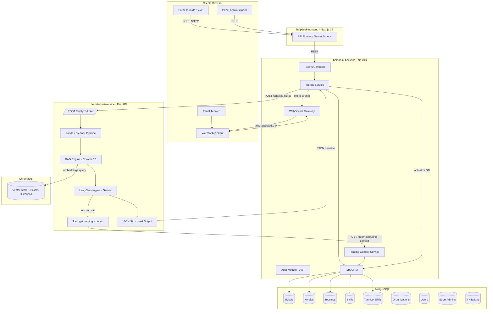
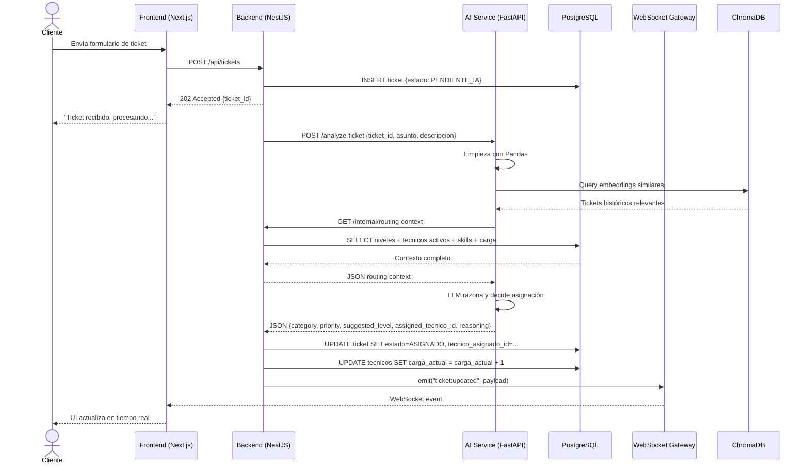
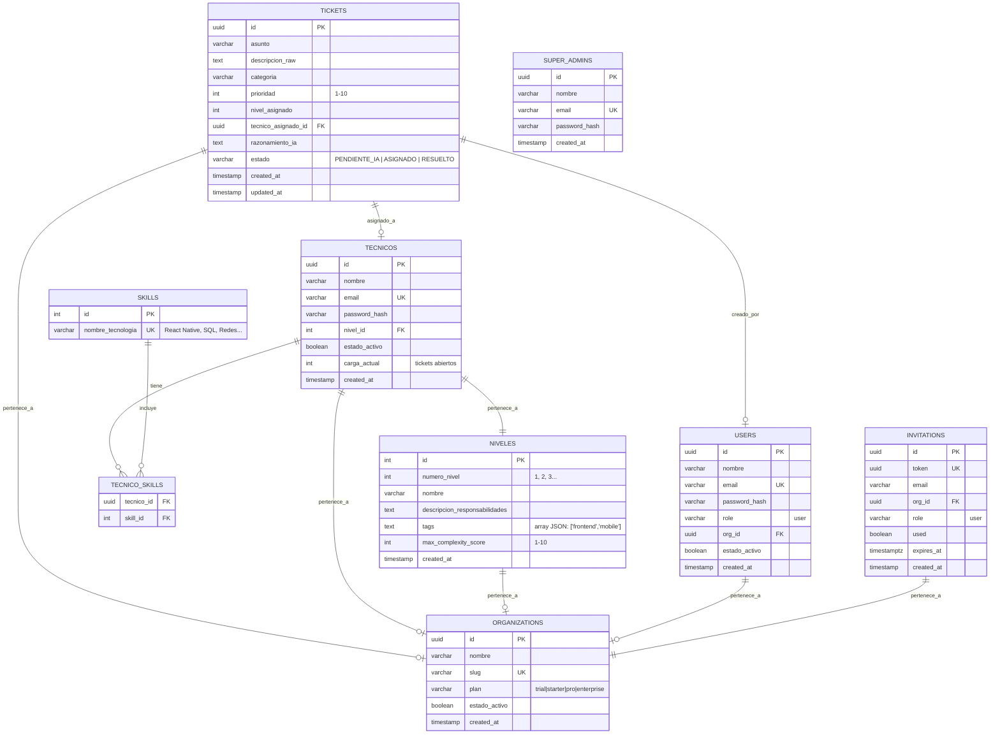
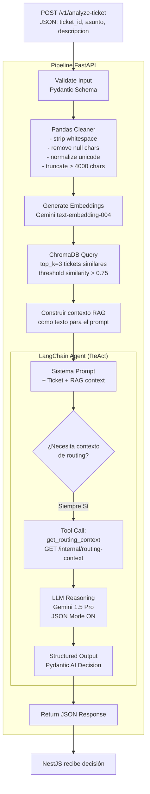
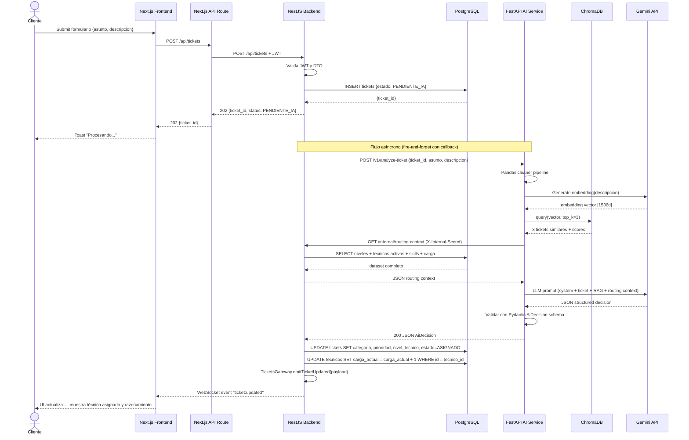
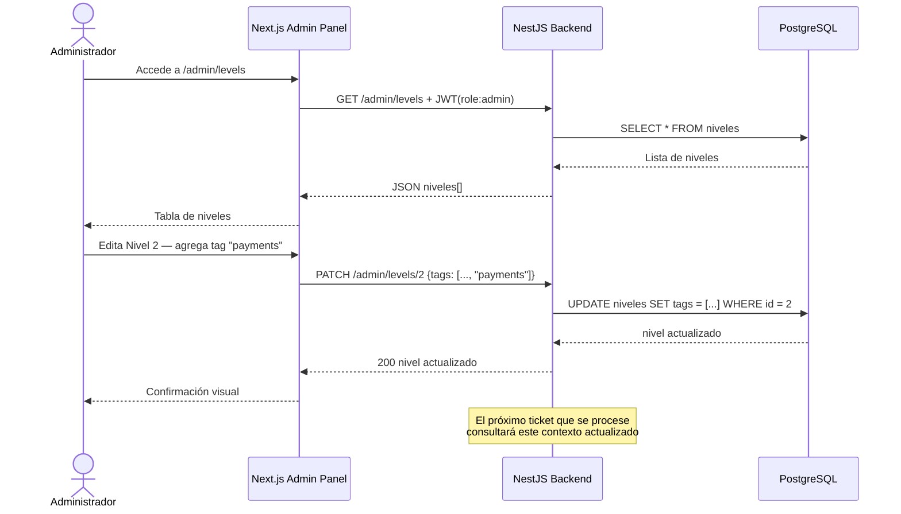

# Software Design Document (SDD)
## Sistema Inteligente de Mesa de Ayuda con IA

**Versión:** 1.2.0  
**Fecha:** 2026-05-23  
**Autor:** Arquitectura de Software — AI Helpdesk Team  
**Estado:** Draft

---

## Tabla de Contenidos

1. [Visión General del Sistema](#1-visión-general-del-sistema)
2. [Arquitectura Global](#2-arquitectura-global)
3. [Repositorios y Estructura de Carpetas](#3-repositorios-y-estructura-de-carpetas)
4. [Modelo de Datos Relacional](#4-modelo-de-datos-relacional)
5. [Contratos de API y JSON](#5-contratos-de-api-y-json)
6. [Flujo de Procesamiento del Agente IA](#6-flujo-de-procesamiento-del-agente-ia)
7. [Comunicación en Tiempo Real (WebSockets)](#7-comunicación-en-tiempo-real-websockets)
8. [Diagramas de Secuencia](#8-diagramas-de-secuencia)
9. [Decisiones de Diseño](#9-decisiones-de-diseño)
10. [Variables de Entorno](#10-variables-de-entorno)

---

## 1. Visión General del Sistema

### 1.1 Objetivo

El sistema automatiza la **clasificación, priorización y asignación dinámica** de tickets de soporte técnico. Un Agente de IA analiza el texto libre del ticket, extrae métricas de negocio (categoría, prioridad, complejidad), consulta en tiempo real la configuración viva de niveles y técnicos disponibles, y retorna una decisión de asignación óptima y fundamentada.

### 1.2 Principios de Diseño

| Principio | Aplicación |
|-----------|------------|
| **Separación de responsabilidades** | Cada repositorio tiene un dominio exclusivo: UI, Orquestación/DB, Inteligencia |
| **Contratos explícitos** | Toda comunicación entre servicios usa JSON schemas versionados |
| **Configuración sin código** | Niveles, skills y técnicos son entidades de base de datos, no hardcode |
| **Tiempo real** | El cliente no necesita polling: recibe el resultado vía WebSocket |
| **Idempotencia** | El servicio de IA puede ser invocado múltiples veces con el mismo ticket sin efectos secundarios |

### 1.3 Repositorios del Proyecto

| Repositorio | Tecnología | Puerto | Responsabilidad |
|-------------|------------|--------|-----------------|
| `helpdesk-front` | Next.js 16, TailwindCSS, TypeScript | 3000 | Portal de clientes y técnicos, WebSocket client |
| `helpdesk-backend` | NestJS, TypeORM, PostgreSQL | 3001 | Orquestación, Auth, Base de datos, WebSocket server |
| `helpdesk-ai-service` | Python 3.11+, FastAPI, LangChain, ChromaDB | 8000 | Agente de IA, RAG, Decisión de asignación |
| `helpdesk-superadmin` | Next.js 16, TailwindCSS, TypeScript | 3002 | Dashboard del dueño del SaaS (multi-tenant management) |

```
git@github.com:ivanviveros007/helpdesk-front.git
git@github.com:ivanviveros007/helpdesk-backend.git
git@github.com:ivanviveros007/helpdesk-ai-service.git
git@github.com:ivanviveros007/helpdesk-superadmin.git
```

---

## 2. Arquitectura Global

### 2.1 Diagrama de Componentes



### 2.2 Flujo de Alto Nivel



---

## 3. Repositorios y Estructura de Carpetas

### 3.1 Repo 1 — `helpdesk-frontend` (Next.js 14)

```
helpdesk-frontend/
├── .env.local
├── next.config.ts
├── tailwind.config.ts
├── tsconfig.json
├── package.json
│
├── public/
│   └── assets/
│
└── src/
    ├── app/                          # App Router root
    │   ├── layout.tsx                # Root layout (providers, fonts)
    │   ├── page.tsx                  # Home — redirect según rol
    │   │
    │   ├── (auth)/
    │   │   ├── login/
    │   │   │   └── page.tsx
    │   │   └── layout.tsx
    │   │
    │   ├── client/                   # Portal del cliente
    │   │   ├── layout.tsx
    │   │   ├── page.tsx              # Dashboard cliente
    │   │   └── new-ticket/
    │   │       └── page.tsx          # Formulario de creación
    │   │
    │   ├── technician/               # Panel técnico
    │   │   ├── layout.tsx
    │   │   ├── page.tsx              # Lista de tickets asignados (realtime)
    │   │   └── [ticketId]/
    │   │       └── page.tsx          # Detalle de ticket
    │   │
    │   ├── admin/                    # Panel administrador
    │   │   ├── layout.tsx
    │   │   ├── page.tsx              # Dashboard admin
    │   │   ├── levels/
    │   │   │   ├── page.tsx          # Lista de niveles
    │   │   │   └── [levelId]/
    │   │   │       └── page.tsx      # Editar nivel
    │   │   └── technicians/
    │   │       ├── page.tsx          # Lista de técnicos
    │   │       └── [techId]/
    │   │           └── page.tsx      # Editar técnico / skills
    │   │
    │   └── api/                      # Next.js API Routes (BFF)
    │       ├── tickets/
    │       │   └── route.ts
    │       ├── admin/
    │       │   ├── levels/
    │       │   │   └── route.ts
    │       │   └── technicians/
    │       │       └── route.ts
    │       └── auth/
    │           └── [...nextauth]/
    │               └── route.ts
    │
    ├── components/
    │   ├── ui/                       # Primitivos (Button, Input, Badge, Modal)
    │   ├── tickets/
    │   │   ├── TicketForm.tsx        # Formulario de creación
    │   │   ├── TicketCard.tsx        # Tarjeta de ticket en lista
    │   │   ├── TicketList.tsx        # Lista con estado realtime
    │   │   └── TicketStatusBadge.tsx
    │   ├── admin/
    │   │   ├── LevelForm.tsx
    │   │   ├── TechnicianForm.tsx
    │   │   └── SkillSelector.tsx
    │   └── layout/
    │       ├── Sidebar.tsx
    │       ├── Header.tsx
    │       └── Providers.tsx         # QueryClient, AuthProvider, WS context
    │
    ├── hooks/
    │   ├── useWebSocket.ts           # Conexión y suscripción WS
    │   ├── useTickets.ts             # React Query para tickets
    │   └── useRealTimeTicket.ts      # Fusiona query + WS updates
    │
    ├── lib/
    │   ├── api-client.ts             # Fetch wrapper hacia el BFF
    │   ├── websocket-client.ts       # Socket.IO client singleton
    │   └── auth.ts                   # NextAuth config
    │
    ├── types/
    │   ├── ticket.ts
    │   ├── technician.ts
    │   ├── level.ts
    │   └── websocket-events.ts
    │
    └── styles/
        └── globals.css
```

**Contrato de WebSocket en el cliente** (`src/types/websocket-events.ts`):

```typescript
export type TicketUpdatedPayload = {
  ticketId: string;
  status: "PENDIENTE_IA" | "ASIGNADO" | "RESUELTO";
  category: string;
  priority: number;
  assignedTechnicianId: string | null;
  assignedTechnicianName: string | null;
  level: number;
  reasoning: string;
};

export type WSEventMap = {
  "ticket:updated": TicketUpdatedPayload;
  "ticket:created": { ticketId: string };
};
```

---

### 3.2 Repo 2 — `helpdesk-backend` (NestJS)

```
helpdesk-backend/
├── .env
├── nest-cli.json
├── tsconfig.json
├── package.json
│
├── src/
│   ├── main.ts                       # Bootstrap, CORS, WS adapter
│   ├── app.module.ts                 # Root module
│   │
│   ├── config/
│   │   └── configuration.ts          # ConfigService schema (env vars)
│   │
│   ├── common/
│   │   ├── decorators/
│   │   │   └── roles.decorator.ts
│   │   ├── guards/
│   │   │   ├── jwt-auth.guard.ts
│   │   │   └── roles.guard.ts
│   │   ├── interceptors/
│   │   │   └── logging.interceptor.ts
│   │   └── filters/
│   │       └── http-exception.filter.ts
│   │
│   ├── auth/
│   │   ├── auth.module.ts
│   │   ├── auth.controller.ts        # POST /auth/login, /auth/refresh
│   │   ├── auth.service.ts
│   │   ├── strategies/
│   │   │   └── jwt.strategy.ts
│   │   └── dto/
│   │       └── login.dto.ts
│   │
│   ├── tickets/
│   │   ├── tickets.module.ts
│   │   ├── tickets.controller.ts     # POST /tickets, GET /tickets/:id
│   │   ├── tickets.service.ts        # Orquesta: guarda → llama IA → actualiza → emite WS
│   │   ├── tickets.gateway.ts        # WebSocket Gateway (@WebSocketGateway)
│   │   ├── entities/
│   │   │   └── ticket.entity.ts
│   │   └── dto/
│   │       ├── create-ticket.dto.ts
│   │       └── ai-decision.dto.ts    # Recibe la decisión del AI Service
│   │
│   ├── levels/
│   │   ├── levels.module.ts
│   │   ├── levels.controller.ts      # CRUD /admin/levels
│   │   ├── levels.service.ts
│   │   ├── entities/
│   │   │   └── level.entity.ts
│   │   └── dto/
│   │       ├── create-level.dto.ts
│   │       └── update-level.dto.ts
│   │
│   ├── technicians/
│   │   ├── technicians.module.ts
│   │   ├── technicians.controller.ts # CRUD /admin/technicians
│   │   ├── technicians.service.ts
│   │   ├── entities/
│   │   │   ├── technician.entity.ts
│   │   │   └── skill.entity.ts
│   │   └── dto/
│   │       ├── create-technician.dto.ts
│   │       └── update-technician.dto.ts
│   │
│   ├── routing/
│   │   ├── routing.module.ts
│   │   ├── routing.controller.ts     # GET /internal/routing-context
│   │   └── routing.service.ts        # Ensambla el contexto completo
│   │
│   └── ai-client/
│       ├── ai-client.module.ts
│       └── ai-client.service.ts      # HTTP client → AI Service
│
├── migrations/
│   └── *.ts                          # TypeORM migrations
│
└── test/
    ├── tickets.e2e-spec.ts
    └── jest-e2e.json
```

---

### 3.3 Repo 3 — `helpdesk-ai-service` (FastAPI)

```
helpdesk-ai-service/
├── .env
├── pyproject.toml                    # uv / poetry config
├── requirements.txt
│
├── app/
│   ├── main.py                       # FastAPI app factory, lifespan
│   │
│   ├── api/
│   │   └── v1/
│   │       ├── router.py             # Agrupa todos los routers v1
│   │       └── endpoints/
│   │           └── tickets.py        # POST /v1/analyze-ticket
│   │
│   ├── core/
│   │   ├── config.py                 # Settings con pydantic-settings
│   │   └── logging.py
│   │
│   ├── schemas/
│   │   ├── ticket_input.py           # Pydantic model: entrada desde NestJS
│   │   └── ai_decision.py            # Pydantic model: salida hacia NestJS
│   │
│   ├── pipeline/
│   │   ├── cleaner.py                # Pandas: limpieza y normalización de texto
│   │   └── embedder.py               # Generación de embeddings (Gemini Embedding)
│   │
│   ├── rag/
│   │   ├── vector_store.py           # Conexión y operaciones ChromaDB
│   │   └── retriever.py              # Query de tickets históricos similares
│   │
│   ├── agent/
│   │   ├── tools.py                  # LangChain Tool: get_routing_context
│   │   ├── prompts.py                # System prompt del agente
│   │   └── agent.py                  # LangChain Agent con Gemini LLM
│   │
│   └── clients/
│       └── backend_client.py         # httpx client → NestJS /internal/routing-context
│
├── scripts/
│   └── ingest_historical.py          # Ingesta inicial de tickets históricos a ChromaDB
│
└── tests/
    ├── test_cleaner.py
    ├── test_rag.py
    └── test_agent.py
```

---

## 4. Modelo de Datos Relacional

### 4.1 Diagrama Entidad-Relación



### 4.2 Definición TypeORM — Entidades clave

**`ticket.entity.ts`**
```typescript
export enum TicketStatus {
  PENDIENTE_IA = "PENDIENTE_IA",
  ASIGNADO = "ASIGNADO",
  RESUELTO = "RESUELTO",
}

@Entity("tickets")
export class Ticket {
  @PrimaryGeneratedColumn("uuid") id: string;
  @Column() asunto: string;
  @Column("text") descripcion_raw: string;
  @Column({ nullable: true }) categoria: string;
  @Column({ nullable: true }) prioridad: number;       // 1-10
  @Column({ nullable: true }) nivel_asignado: number;
  @ManyToOne(() => Technician, { nullable: true })
  @JoinColumn({ name: "tecnico_asignado_id" })
  tecnico_asignado: Technician;
  @Column("text", { nullable: true }) razonamiento_ia: string;
  @Column({ type: "enum", enum: TicketStatus, default: TicketStatus.PENDIENTE_IA })
  estado: TicketStatus;
  @CreateDateColumn() created_at: Date;
  @UpdateDateColumn() updated_at: Date;
}
```

**`level.entity.ts`**
```typescript
@Entity("niveles")
export class Level {
  @PrimaryGeneratedColumn() id: number;
  @Column() numero_nivel: number;
  @Column() nombre: string;
  @Column("text") descripcion_responsabilidades: string;
  @Column("simple-array") tags: string[];
  @Column() max_complexity_score: number;
  @CreateDateColumn() created_at: Date;
}
```

**`technician.entity.ts`**
```typescript
@Entity("tecnicos")
export class Technician {
  @PrimaryGeneratedColumn("uuid") id: string;
  @Column() nombre: string;
  @Column({ unique: true }) email: string;
  @Column() password_hash: string;
  @Column({ type: "enum", enum: TechnicianRole, default: TechnicianRole.TECHNICIAN })
  role: TechnicianRole;                  // 'technician' | 'admin'
  @ManyToOne(() => Level, { eager: true, nullable: true })
  @JoinColumn({ name: "nivel_id" })
  nivel: Level;
  @Column({ default: true }) estado_activo: boolean;
  @Column({ default: 0 }) carga_actual: number;
  @ManyToMany(() => Skill, { eager: true, cascade: true })
  @JoinTable({ name: "tecnico_skills" })
  skills: Skill[];
  @Column({ nullable: true }) org_id: string;
  @CreateDateColumn() created_at: Date;
}
```

**`user.entity.ts`** (clientes que crean tickets)
```typescript
@Entity("users")
export class User {
  @PrimaryGeneratedColumn("uuid") id: string;
  @Column() nombre: string;
  @Column({ unique: true }) email: string;
  @Column() password_hash: string;
  @Column({ default: "user" }) role: string;
  @Column({ nullable: true }) org_id: string;
  @Column({ default: true }) estado_activo: boolean;
  @CreateDateColumn() created_at: Date;
}
```

**`organization.entity.ts`**
```typescript
@Entity("organizations")
export class Organization {
  @PrimaryGeneratedColumn("uuid") id: string;
  @Column() nombre: string;
  @Column({ unique: true }) slug: string;
  @Column({ default: "trial" }) plan: string;
  @Column({ default: true }) estado_activo: boolean;
  @CreateDateColumn() created_at: Date;
}
```

**`invitation.entity.ts`**
```typescript
@Entity("invitations")
export class Invitation {
  @PrimaryGeneratedColumn("uuid") id: string;
  @Column({ unique: true }) token: string;   // UUID generado en el service
  @Column() email: string;
  @Column() org_id: string;
  @Column({ default: "user" }) role: string;
  @Column({ default: false }) used: boolean;
  @Column({ type: "timestamptz" }) expires_at: Date;
  @CreateDateColumn() created_at: Date;
}
```

---

## 5. Contratos de API y JSON

### 5.1 Frontend → Backend

#### `POST /api/tickets`

**Request body:**
```json
{
  "asunto": "La app mobile crashea al abrir el módulo de pagos",
  "descripcion": "Desde la actualización de ayer, cuando el usuario intenta entrar a la sección de pagos la app cierra de golpe. Ocurre en iOS 17 y Android 14. Error en Sentry: NullPointerException en PaymentViewModel."
}
```

**Response `202 Accepted`:**
```json
{
  "ticket_id": "a1b2c3d4-e5f6-7890-abcd-ef1234567890",
  "status": "PENDIENTE_IA",
  "message": "Ticket recibido. Procesando con IA..."
}
```

---

### 5.2 Backend → AI Service

#### `POST /v1/analyze-ticket`

**Request body (NestJS → FastAPI):**
```json
{
  "ticket_id": "a1b2c3d4-e5f6-7890-abcd-ef1234567890",
  "asunto": "La app mobile crashea al abrir el módulo de pagos",
  "descripcion": "Desde la actualización de ayer, cuando el usuario intenta entrar a la sección de pagos la app cierra de golpe. Ocurre en iOS 17 y Android 14. Error en Sentry: NullPointerException en PaymentViewModel."
}
```

**Response `200 OK` (FastAPI → NestJS):**
```json
{
  "ticket_id": "a1b2c3d4-e5f6-7890-abcd-ef1234567890",
  "category": "mobile_crash",
  "priority": 8,
  "complexity_score": 7,
  "suggested_level": 2,
  "assigned_tecnico_id": "b9c8d7e6-f5a4-3210-fedc-ba9876543210",
  "reasoning": "El ticket describe un crash crítico en el módulo de pagos afectando iOS y Android tras una actualización reciente. La presencia de un NullPointerException en PaymentViewModel indica un bug de lógica en la capa de datos del módulo de pagos móvil. Se clasifica complejidad 7/10. El Nivel 2 cubre 'mobile, payments'. Se selecciona al técnico Martínez (Nivel 2, skills: React Native, Kotlin, payments) sobre González (mismo nivel) por menor carga de trabajo: 2 vs 4 tickets abiertos.",
  "similar_tickets": [
    {
      "ticket_id": "hist-001",
      "similarity_score": 0.91,
      "resolution_summary": "El crash fue causado por una migración de base de datos local que no se ejecutó en el build de release."
    }
  ]
}
```

---

### 5.3 AI Service → Backend (Routing Context)

#### `GET /internal/routing-context`

**Headers requeridos:**
```
X-Internal-Secret: {INTERNAL_API_SECRET}
```

**Response `200 OK`:**
```json
{
  "generated_at": "2026-05-22T14:30:00Z",
  "niveles": [
    {
      "id": 1,
      "numero_nivel": 1,
      "nombre": "Soporte Básico",
      "descripcion_responsabilidades": "Problemas de acceso, reseteo de contraseñas, configuración de cuentas, onboarding.",
      "tags": ["access", "accounts", "onboarding", "password"],
      "max_complexity_score": 3
    },
    {
      "id": 2,
      "numero_nivel": 2,
      "nombre": "Soporte Técnico",
      "descripcion_responsabilidades": "Bugs en aplicaciones web y mobile, problemas de integración, errores de base de datos, módulo de pagos.",
      "tags": ["web", "mobile", "bugs", "database", "payments", "api"],
      "max_complexity_score": 7
    },
    {
      "id": 3,
      "numero_nivel": 3,
      "nombre": "Ingeniería Avanzada",
      "descripcion_responsabilidades": "Arquitectura, seguridad, performance crítica, infraestructura, incidentes de producción graves.",
      "tags": ["security", "infrastructure", "performance", "architecture", "production-incident"],
      "max_complexity_score": 10
    }
  ],
  "tecnicos": [
    {
      "id": "b9c8d7e6-f5a4-3210-fedc-ba9876543210",
      "nombre": "Carlos Martínez",
      "nivel_id": 2,
      "numero_nivel": 2,
      "estado_activo": true,
      "carga_actual": 2,
      "skills": ["React Native", "Kotlin", "Swift", "payments", "REST APIs"]
    },
    {
      "id": "c3d4e5f6-a7b8-9012-cdef-234567890123",
      "nombre": "Ana González",
      "nivel_id": 2,
      "numero_nivel": 2,
      "estado_activo": true,
      "carga_actual": 4,
      "skills": ["React Native", "Flutter", "Firebase"]
    },
    {
      "id": "d4e5f6a7-b8c9-0123-defg-345678901234",
      "nombre": "Pedro Jiménez",
      "nivel_id": 1,
      "numero_nivel": 1,
      "estado_activo": true,
      "carga_actual": 5,
      "skills": ["helpdesk", "accounts", "onboarding"]
    }
  ]
}
```

---

### 5.4 Backend → Frontend (WebSocket)

**Evento:** `ticket:updated`

```json
{
  "event": "ticket:updated",
  "data": {
    "ticketId": "a1b2c3d4-e5f6-7890-abcd-ef1234567890",
    "status": "ASIGNADO",
    "category": "mobile_crash",
    "priority": 8,
    "level": 2,
    "assignedTechnicianId": "b9c8d7e6-f5a4-3210-fedc-ba9876543210",
    "assignedTechnicianName": "Carlos Martínez",
    "reasoning": "El ticket describe un crash crítico en el módulo de pagos...",
    "updatedAt": "2026-05-22T14:30:05Z"
  }
}
```

---

## 6. Flujo de Procesamiento del Agente IA

### 6.1 Pipeline Interno del Agente



### 6.2 System Prompt del Agente (`app/agent/prompts.py`)

```python
SYSTEM_PROMPT = """
Eres un agente experto en mesa de ayuda técnica. Tu única responsabilidad es analizar tickets de soporte y tomar decisiones de clasificación y asignación basadas en datos objetivos.

## PROCESO OBLIGATORIO
1. Analiza el asunto y descripción del ticket.
2. Usa la herramienta `get_routing_context` para obtener la configuración actual de niveles y técnicos disponibles.
3. Evalúa la complejidad del problema en una escala del 1 al 10.
4. Determina la categoría del ticket.
5. Determina la prioridad del 1 (mínima) al 10 (máxima urgencia).
6. Selecciona el nivel de soporte cuyo `max_complexity_score` sea >= tu evaluación de complejidad y cuyas responsabilidades descritas y tags sean las más relevantes para el problema.
7. De los técnicos activos (`estado_activo: true`) en ese nivel, selecciona el más idóneo cruzando sus skills con las necesidades del ticket. En caso de empate de idoneidad, elige al que tenga menor `carga_actual`.
8. Retorna SIEMPRE un JSON válido con la estructura exacta definida. Sin texto adicional, sin markdown, solo JSON.

## CRITERIOS DE PRIORIDAD
- 9-10: Sistema de producción caído, pérdida de datos, brecha de seguridad activa.
- 7-8: Feature crítica del negocio inoperable, crash reproducible, pagos afectados.
- 5-6: Feature importante degradada con workaround disponible.
- 3-4: Bug menor, problema cosmético con impacto bajo.
- 1-2: Pregunta de uso, mejora sugerida, duda informativa.

## FORMATO DE SALIDA OBLIGATORIO (JSON Mode)
{
  "ticket_id": "string",
  "category": "string",
  "priority": "int (1-10)",
  "complexity_score": "int (1-10)",
  "suggested_level": "int",
  "assigned_tecnico_id": "string | null",
  "reasoning": "string (explicación detallada en español)",
  "similar_tickets": [{"ticket_id": "string", "similarity_score": "float", "resolution_summary": "string"}]
}
"""
```

### 6.3 LangChain Tool Definition (`app/agent/tools.py`)

```python
from langchain.tools import tool
from app.clients.backend_client import get_routing_context_from_backend

@tool
async def get_routing_context() -> dict:
    """
    Obtiene la configuración actual del sistema de soporte en tiempo real.
    Retorna los niveles de soporte (sus responsabilidades, tags y complejidad máxima)
    y todos los técnicos activos con sus skills y carga de trabajo actual.
    SIEMPRE usar esta herramienta antes de asignar un ticket.
    """
    return await get_routing_context_from_backend()
```

---

## 7. Comunicación en Tiempo Real (WebSockets)

### 7.1 Configuración del Gateway NestJS

Cada usuario/técnico se une a su propia room al conectarse. No hay broadcasts globales.

**Rooms:**
| Room | Se une | Evento que recibe |
|---|---|---|
| `tech:{id}` | Técnico (query param: `technicianId`) | `ticket:assigned_to_you` |
| `user:{id}` | Cliente (query param: `userId`) | `ticket:status_changed` |

**`tickets.gateway.ts`**
```typescript
@WebSocketGateway({
  cors: { origin: (origin, cb) => cb(null, true), credentials: true },
  namespace: "/tickets",
})
export class TicketsGateway implements OnGatewayConnection {
  @WebSocketServer() server: Server;

  emitTicketUpdated(payload: TicketUpdatedPayload): void {
    // Notifica al técnico asignado
    if (payload.assignedTechnicianId) {
      this.server
        .to(`tech:${payload.assignedTechnicianId}`)
        .emit("ticket:assigned_to_you", payload);
    }
    // Notifica al usuario creador
    if (payload.createdByUserId) {
      this.server
        .to(`user:${payload.createdByUserId}`)
        .emit("ticket:status_changed", payload);
    }
  }

  handleConnection(client: Socket): void {
    const { technicianId, userId } = client.handshake.query;
    if (technicianId) client.join(`tech:${technicianId}`);
    if (userId) client.join(`user:${userId}`);
  }
}
```

### 7.2 Hook en el Frontend

**`src/hooks/useWebSocket.ts`**
```typescript
// Acepta technicianId (string legacy) o { technicianId?, userId? }
export function useWebSocket(
  options: { technicianId?: string; userId?: string } | string | undefined,
  onEvent: (event: string, payload: TicketUpdatedPayload) => void
) {
  useEffect(() => {
    const opts = typeof options === "string" ? { technicianId: options } : options ?? {};
    const socket = getSocket(opts);   // singleton por query params

    socket.on("ticket:assigned_to_you", (p) => onEvent("ticket:assigned_to_you", p));
    socket.on("ticket:status_changed", (p) => onEvent("ticket:status_changed", p));

    return () => { socket.off("ticket:assigned_to_you"); socket.off("ticket:status_changed"); };
  }, []);
}
```

---

## 8. Diagramas de Secuencia

### 8.1 Creación de Ticket — Flujo Completo



### 8.2 Configuración de Niveles por Admin



---

## 9. Decisiones de Diseño

### 9.1 Por qué Inyección Dinámica de Contexto (Tool Calling) y no Contexto Estático

| Alternativa | Problema |
|-------------|----------|
| Prompt con niveles hardcodeados | Al cambiar un nivel, habría que redeployar el AI service |
| Caché en el AI service (TTL) | Ventana de inconsistencia donde técnicos inactivos reciben asignaciones |
| **Tool Calling en tiempo real** ✓ | El Agente siempre trabaja con el estado actual de la DB. Sin caché, sin deuda de sincronización |

### 9.2 Por qué ChromaDB y RAG

El LLM sólo tiene conocimiento general. El RAG provee **memoria institucional**: tickets resueltos anteriormente con resoluciones documentadas. Esto permite al agente:
- Reconocer patrones recurrentes
- Sugerir resoluciones probadas en el `reasoning`
- Mejorar la calidad de la priorización basada en cómo tickets similares fueron tratados históricamente

### 9.3 Seguridad del Endpoint Interno

El endpoint `GET /internal/routing-context` NO debe ser accesible públicamente. Mecanismo de protección:

```typescript
// routing.controller.ts
@Get()
@UseGuards(InternalSecretGuard)  // Verifica X-Internal-Secret header
async getRoutingContext() { ... }
```

```python
# backend_client.py
headers = {"X-Internal-Secret": settings.INTERNAL_API_SECRET}
```

El `INTERNAL_API_SECRET` es un secreto compartido entre los dos servicios, configurado vía variable de entorno.

### 9.4 Gestión de Carga del Técnico

`carga_actual` es un contador en DB que se incrementa al asignar y decrementa al resolver. Este contador provee al Agente de IA un desempate objetivo basado en datos reales, sin requerir lógica adicional en el prompt.

---

## 10. Variables de Entorno

### 10.1 `helpdesk-backend/.env`

```env
# Database
DATABASE_URL=postgresql://bambam@localhost:5432/helpdesk_db

# JWT
JWT_SECRET=super_secret_key_min_32_chars
JWT_EXPIRATION=7d

# AI Service
AI_SERVICE_URL=http://localhost:8000

# Internal comms
INTERNAL_API_SECRET=random_shared_secret_256bits

# WebSockets / CORS
FRONTEND_URL=http://localhost:3000
SUPERADMIN_URL=http://localhost:3002

# App
PORT=3001
NODE_ENV=development
```

### 10.2 `helpdesk-ai-service/.env`

```env
# Gemini
GEMINI_API_KEY=your_gemini_api_key
GEMINI_MODEL=gemini-1.5-pro
GEMINI_EMBEDDING_MODEL=text-embedding-004

# ChromaDB
CHROMA_HOST=localhost
CHROMA_PORT=8001
CHROMA_COLLECTION=helpdesk_tickets

# Backend
BACKEND_URL=http://localhost:3001
INTERNAL_API_SECRET=random_shared_secret_256bits

# App
PORT=8000
LOG_LEVEL=INFO
```

### 10.3 `helpdesk-front/.env.local`

```env
# Backend API
NEXT_PUBLIC_API_URL=http://localhost:3001/api
NEXT_PUBLIC_WS_URL=http://localhost:3001
NEXT_PUBLIC_APP_URL=http://localhost:3000
```

### 10.4 `helpdesk-superadmin/.env.local`

```env
NEXT_PUBLIC_API_URL=http://localhost:3001/api
```

---

## Apéndice A — Esquema Pydantic del AI Service

```python
# app/schemas/ticket_input.py
from pydantic import BaseModel

class TicketInput(BaseModel):
    ticket_id: str
    asunto: str
    descripcion: str

# app/schemas/ai_decision.py
from pydantic import BaseModel
from typing import Optional

class SimilarTicket(BaseModel):
    ticket_id: str
    similarity_score: float
    resolution_summary: str

class AiDecision(BaseModel):
    ticket_id: str
    category: str
    priority: int                         # 1-10
    complexity_score: int                 # 1-10
    suggested_level: int
    assigned_tecnico_id: Optional[str]    # None si no hay técnico disponible
    reasoning: str
    similar_tickets: list[SimilarTicket]
```

---

## Apéndice B — DTOs NestJS Clave

```typescript
// create-ticket.dto.ts
export class CreateTicketDto {
  @IsString() @MinLength(5) @MaxLength(200)
  asunto: string;

  @IsString() @MinLength(10) @MaxLength(5000)
  descripcion: string;
}

// ai-decision.dto.ts
export class AiDecisionDto {
  @IsUUID() ticket_id: string;
  @IsString() category: string;
  @IsInt() @Min(1) @Max(10) priority: number;
  @IsInt() @Min(1) @Max(10) complexity_score: number;
  @IsInt() suggested_level: number;
  @IsUUID() @IsOptional() assigned_tecnico_id: string | null;
  @IsString() reasoning: string;
  @IsArray() similar_tickets: SimilarTicketDto[];
}
```

---

*Última actualización: 2026-05-23. Versión 1.2.0 — Revisar ante cambios en la arquitectura de niveles, el modelo de datos o el LLM utilizado.*
